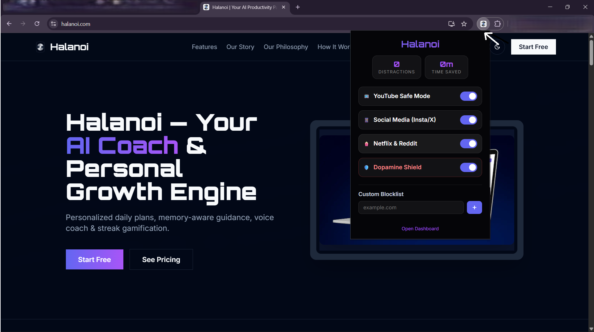
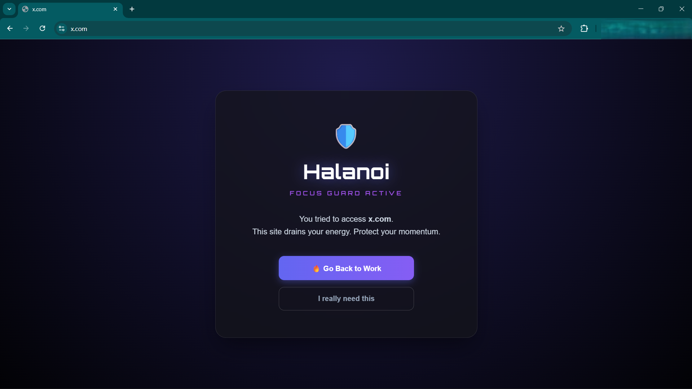
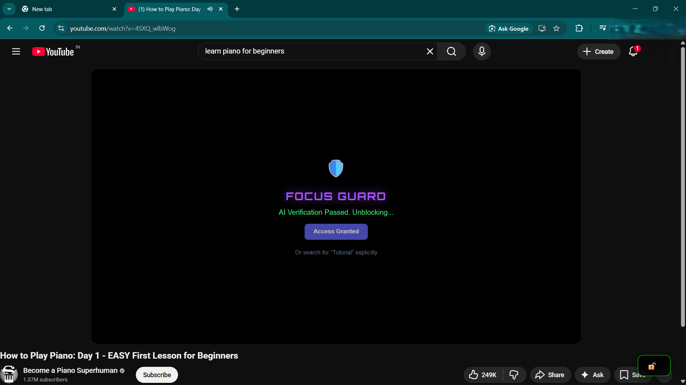

# Halanoi Focus Guard 🛡️

AI-powered Chrome extension for productivity.

---

## 📦 Installation

Get the official extension for your browser:

| Chrome Web Store | Microsoft Edge Add-ons |
| :---: | :---: |
|  |  |

---

## 🚀 Features
- Context-aware focus prompts
- Cloud AI inference integration
- Browser activity tracking
- Lightweight UI popup
- **YouTube Title AI Classification**: Scans and parses video titles before they load, matching them against your focus rules.
- **Domain & Keyword Blocker**: Instantly blocks distracting websites based on your custom focus configurations.
- **Zero-Tracking Privacy**: No browsing history, search logs, or credentials are ever stored. (See [SECURITY.md](SECURITY.md)).

---

## 📸 Screenshots

### Menu Popup

### Focus Blocking Screen

### Productivity Success

---

## 🛠️ Local Development & Setup

If you want to run the code locally or contribute to the project:

### 1. Developer Installation:
1. Clone this repository to your PC.
2. Open your browser and navigate to the extensions management page:
   - **Chrome**: `chrome://extensions/`
   - **Edge**: `edge://extensions/`
3. Enable **Developer Mode** (top-right toggle).
4. Click **Load unpacked** (top-left) and select this repository folder.

### 2. Configure Backend Credentials:
Before running the extension locally, you must configure your own backend endpoint for AI classification. Please refer to [SECURITY.md](SECURITY.md) for detailed configuration guidelines.

---

## 📐 Tech Stack
JavaScript, Chrome Extension APIs, Cloud AI

## 📝 License
This project is open-source and licensed under the **MIT License** (see [LICENSE](LICENSE) for details).

---

## 👤 Author
Kavinmaran Ravidurai
